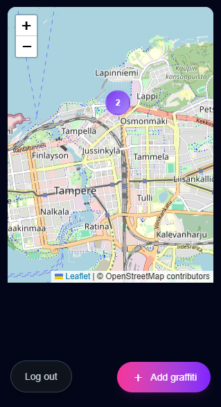
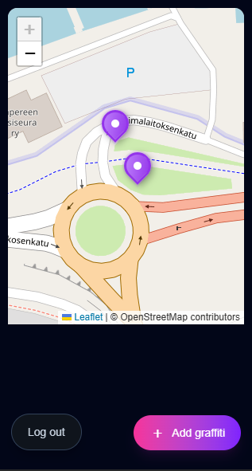
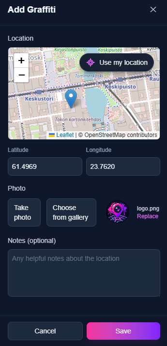

# GraffSnap

GraffSnap is a mobile-first web app built for tracking and documenting the public graffiti work of a specific graffiti artist. Users can view sightings on a map, while authenticated users can add new locations with photos and optional notes.

## ✨ Features

- 🗺️ Interactive map using Leaflet and OpenStreetMap
- 🗺️ Marker clustering for nearby graffiti sightings
- 📍 Save graffiti locations with latitude and longitude
- 📷 Take photos directly from a mobile device or choose existing images
- 🖼️ Resize and convert uploaded images to WebP with Sharp
- ☁️ Store and optimize images with Cloudinary
- 📝 Optional notes and timestamps for each graffiti sighting
- 🔎 View graffiti information and images directly from map markers
- 📍 Use device location to select a graffiti location
- 🔐 Authentication with Neon Auth
- 👤 Protected graffiti creation for authenticated users
- 🗄️ PostgreSQL database with Neon and Drizzle ORM
- ☁️ Deployed with Vercel

---

## Screenshots

<p align="center">
  <a href="public/screenshots/screenshot1.png">
    
  </a>
  <a href="public/screenshots/screenshot2.png">
    
  </a>
  <a href="public/screenshots/screenshot3.png">
    
  </a>
</p>

---

## 🧰 Tech Stack

### Frontend

- **Next.js**
- **React**
- **TypeScript**
- **Tailwind CSS**
- **Leaflet**
- **React Leaflet**
- **OpenStreetMap**

### Backend

- **Next.js App Router**
- **Neon PostgreSQL**
- **Drizzle ORM**
- **Neon Auth**
- **Zod**

### Images

- **Cloudinary**
- **Sharp**

### Deployment

- **Vercel**

---

## Creating a user

GraffSnap is a personal project and does not provide public user registration.
Users are created manually through the CLI:

```bash
npm run create-user
```

The script asks for:

```text
GraffSnap user creation

Name: Anssi
Email: anssi@example.com
Password: ****

Creating user...
✓ User created successfully
```
